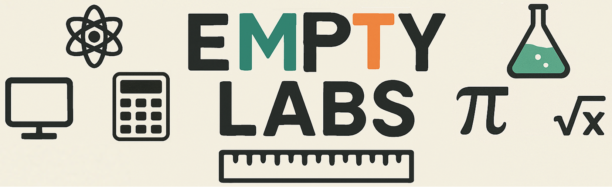

# Desk Cycle

This is a health monitoring project dedicated to visualizing progress on my stationary bike exercise using the Desk Cycle.

## Conda environment

When setting up the project, consider using a conda environment to isolate the required packages.

1. Set up jupyter for conda environment ([sauce](https://stackoverflow.com/questions/39604271/conda-environments-not-showing-up-in-jupyter-notebook))

```commandline
pip install jupyter ipykernel
```
```commandline
python -m ipykernel install --user --name desk-cycle --display-name "desk-cycle"
```
